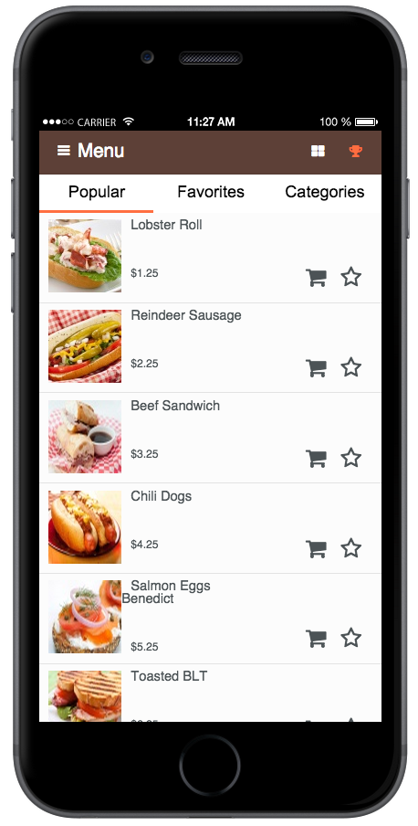

# Dineissimo

A sample AppBuilder app for a hypothetical small restaurant chain.

## Tutorials

This repository contains four embedded tutorials to help you extend the Dineissimo app and learn more about the [Telerik Platform](telerik.com/platform):

* [Make it your Own: Reskin the Dineissimo App](tutorials/tutorial-1-dineissimo.md)
* [Getting Friendly: Adding the Social Plugin to the Dineissimo app](tutorials/tutorial-2-dineissimo.md)
* [Create a Great Checkout Experience for the Dineissimo App using the Stripe Plugin](tutorials/tutorial-3-dineissimo.md)
* [Add Backend Cloud Services and e-mail notifications to the Dineissimo app](tutorials/tutorial-4-dineissimo.md)
