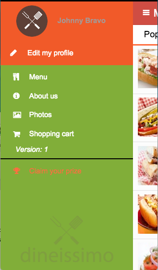
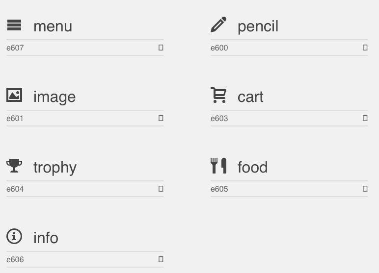
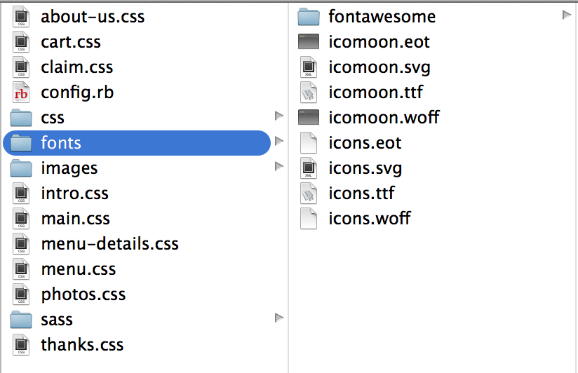

 ---
##Welcome!
Telerik's Platform solution makes it incredibly easy for developers to build, modify and deploy hybrid mobile apps. We want you to experience the difference yourself. Try out our platform by deploying this sample app, "Dineissimo" to your device. Then, find out how easy it is to alter its look and add cool features by following our helpful tutorials. Each tutorial walks you through different capabilities and has beginner, intermediate and “Ninja” level instructions. Here are the links:

* [Re-skin your app](tutorial-1-dineissimo.md)
* [Add a social plugin](tutorial-2-dineissimo.md)
* [Create a great checkout experience](tutorial-3-dineissimo.md)
* [Add backend cloud services and email notifications](tutorial-4-dineissimo.md)

---

# Make it your Own: Reskin the Dineissimo App

Kendo offers a basic set of styles for its widgets so that you can have a good-looking app right out of the box even if you don’t want to add additional styling. Most developers, however, need to create apps that reflect their brand colors and look-and-feel or that simply reflects the app’s content; a children’s app will look different than a utility or business app. In this tutorial, you will learn how to [change the basic colors in your app](#beginner), how to [change the icons](#intermediate), and how to [use a css preprocessor](#advanced), Sass, to speed up your css workflow.

## [Beginner: Add a New Color Scheme](id:beginner)

Now that you have a fully-functioning app built, it’s time to go a step further and customize its look and feel. In this section, you’re going to change the color scheme using a palette from ColourLovers.com. Feel free to try different palettes if you like! To get started, open the app you already created in your Platform account at [platform.telerik.com](http://platform.telerik.com). 

### Step 1: Find a new Color Scheme:

The Dineissimo app has several style sheets: a base kendo mobile style sheet and css that corresponds to each part of the app. 

```
    <link href="kendo/styles/kendo.mobile.all.min.css" rel="stylesheet" />
    <link href="styles/main.css" rel="stylesheet" />
    <link href="styles/about-us.css" rel="stylesheet" />
    <link href="styles/menu.css" rel="stylesheet" />
    <link href="styles/photos.css" rel="stylesheet" />
    <link href="styles/claim.css" rel="stylesheet" />
    <link href="styles/menu-details.css" rel="stylesheet" />
    <link href="styles/cart.css" rel="stylesheet" />
    <link href="styles/thanks.css" rel="stylesheet" />
    <link href="styles/intro.css" rel="stylesheet" />
    <link href="styles/fonts/fontawesome/css/font-awesome.css" rel="stylesheet" />
    <link href="styles/fonts/wp_icons.css" rel="stylesheet" />
```
It’s time to change up the color scheme. It’s pretty straightforward to change any app’s colors manually by changing its css. Maybe you want to change the color scheme from brown to reflect the organic nature of the restaurant’s offerings, or change it to a fast-food type color palette. Take a look at a very useful website for designers, [ColourLovers](http://www.colourlovers.com), and search for ‘restaurant’. You’ll find all sorts of inspiration. Use a palette called  ‘[Cuisine](http://www.colourlovers.com/palette/1972507/Cuisine)’.


### Step 2: Alter the CSS:

You can use the first red color for the header.
The palette has its colors listed in both Hex format and RGB. Using the colors listed in the Cuisine palette on ColourLovers, copy the red RGB value (204,63,53) and paste it in main.css in the class .km-navbar to override the base color of the top navbar:

```
 .km-navbar {
     background-color: rgba(204,63,53, 0.92) !important;
     color:white !important;
 }
```

While you’re at it, change the color of the flyout drawer menu to green by changing the background color of the #appDrawer element: 

```
  #appDrawer .km-content, #editProfileDrawer .km-content {
    background-color: #81AE39;
  }
```
Finally, change the #user-panel background color to orange: 

```
  #user-panel {
     background-color: #F15A29;
     height: 130px;
  }

```

Nice! It’s so cheery! You could continue to make more changes if you like, for example to darken some of the fonts so they show up better. 



## [Intermediate: Change the icons](id:intermediate)

Diving deeper into the css, we can start really customizing our app to use a different icon font. Icons can really impact the look and feel of your app. Let’s change our app by using different icons from [Icomoon](http://www.icomoon.io). There are a lot of icons in this app, so for the purposes of a short tutorial, let’s concentrate on swapping the ones we see above: the hamburger (menu), pencil, fork/knife, about, photos, cart, and trophy.

### Step 1: Find some new icons

Visit [Icomoon](http://www.icomoon.io) and click the red "IcoMoon App" button. Click "Add Icons from Library" and select the ‘Icomoon - Free’ library. This group of icons will be imported into your Icomoon workspace. Select the seven icons mentioned above and click the ‘Generate Font’ button:




Download a zip file of these icons by clicking the ‘download’ button. Expand the zip file and upload the four files in the font folder to your app’s styles/font folder. These will be called icomoon.eot, icomoon.svg, icomoon.ttf, and icomoon.woff. 




### Step 2: Install the icons

Next, look at styles/main.css again. The font icons are formatted here. Change the @font-face style to reference the new files you imported:

```
@font-face {
     font-family: "icon-font";
     src: url("fonts/icomoon.woff") format("woff"), url("fonts/icomoon.ttf") format("truetype");
 }
```
Notice, all your icons have disappeared! This is because you’re referencing new icon font files. In the screenshot above, note the code underneath each icon. You’re going to use those codes to change the side menu icons. 

Edit the icon styles so they reflect your new icons:

```
.km-food:before, .km-food:after {
     content: '\e605';
 }
 .km-info:before, .km-info:after {
     content: '\e606';
 }
 .km-picture:before, .km-picture:after {
     content: '\e601';
 }
 .km-basket:before, .km-basket:after {
     content: '\e603';
 }
 .km-award:before, .km-award:after {
     content: '\e604';
 }
 .km-pencil:before, .km-pencil:after {
     content: '\e600';
 }
 .km-menu:before, .km-menu:after {
     content: '\e607';
 }
 ```

and one more, down around line 179:

```
#edit-link:before {
    font: 1em / 1em "icon-font";
    content: '\e600';
 }
```
When you save your changes, you’ll see your new icons in the simulator:


### Step 3: Replace the remaining icons:

If you like your new icons, hunt through the app and find all the icons you’d like to change, and swap them! Or try new icon fonts; there are many to try online and Icomoon allows you to import various sets. 

## [Ninja: Add a little Sass](id:advanced)

Now that you’ve been digging into the css, you might prefer to use a css preprocessor to make the changes easier to manage. In this section, you’ll learn how to convert the current css to Sass so the end product will be one big concatenated and compressed style sheet. Sass gives you a lot of extra power over your style sheets, including and you might prefer to use Sass just as a matter of habit, so here are pointers to get you started.

> Note: in this section, you need to use the Appbuilder CLI (command-line interface). The AppBuilder CLI is an alternative to the in-browser editor for building AppBuilder apps. The CLI gives you more power over your workflows, and is needed for really complex workflows such as custom SASS integration shown in this step. Learn more about the Appbuilder CLI, including how to install it, here: [http://www.telerik.com/appbuilder/command-line-interface](http://www.telerik.com/appbuilder/command-line-interface). In addition, I also assume that you have Ruby and Sass available on your local machine. If you don’t, install Sass following these instructions: http://sass-lang.com/install. Finally, in order to work locally, you need a copy of the Dineissimo codebase. If you have been working in the in-browser-editor up to now, you can click on the bar in the Project Navigator part of the Platform screen and click ‘Export’. This will allow you to download a zipped file of your codebase. Expand that zip file on your local computer and use your command-line interface to cd to it:

```
> cd Desktop/Dineissimo/app
```

Then type

```
> appbuilder simulate
```

The Appbuilder simulator will open and you can continue your development locally.

## Step 1: Fire up Sass

First, create a folder called /sass in the /styles folder. We’re going to ask Sass to ‘watch’ this folder. When it sees a new .scss file or if such a file changes, it’s going to build a condensed version of it in standard css format and place it in a /css folder. To make this happen, run the following command:

```
> sass —watch sass:css —style compressed
```

## Step 2: Move the css files to the sass folder, change them to scss format and rebuild

Next, we need to convert our plain-vanilla css into the Sass language in that /sass folder. You need to save them as .scss files. Copy all the css files from the css folder and paste them into the sass folder. Change the file names from your command-line:

```
for files in *.css
do
mv "$files" "${files%.css}.scss"
done
```

Now, let’s create a styles.scss file in the /sass folder. We’re going to build this file by including all the .scss files in the right order:


```
@import "main";
@import "about-us";
@import "menu";
@import "photos";
@import "claim";
@import "menu-details";
@import "cart";
@import "thanks";
@import "intro";

```
That styles.scss file is going to be saved as styles.css in /css. If you open that file, you’ll see the css all compressed into one line so that it’s really small. Your final task will be to link this one file within your index.html; you can then remove the link href references to the custom stylesheets and instead link only to:

```
<link href="styles/css/styles.css" rel="stylesheet" />
   
```

Notice that you might be missing some assets, including the icons we created earlier, since the paths have changed a bit with the introduction of the new /css folder. This can be fixed by changing the lines at the top of sass/main.scss:
```
@font-face {
  font-family: "icon-font";
  src: url("../fonts/icomoon.woff") format("woff"), url("../fonts/icomoon.ttf") format("truetype");
}
```
You might need to change the path for other assets--so be a real ninja and in your simulator, go to Tools>Developer Tools and look in the console for any other incorrect paths.

## Step 3: Do a little Sassy magic!

Sass is a great tool to help keep your code DRY (Don’t Repeat Yourself). Looking through the scss files, you can see that the css code around icons tends to repeat itself. You can create a Sass ‘Mixin’ to make the code a little more maintainable. 

To create a mixin for our icons, just put this snippet at the top of main.scss:

```
@mixin icon($content){
  font: 1em / 1em "icon-font";
  content: $content;
}
``` 
Here, we are creating a mixin called ‘icon’ that takes a content code as a parameter. The icons always have a fixed size and use the icon-font, and the variable will tell Sass how to compile the icon code that we will pass in. 

Now you can delete the extra css that defines the .km-icon class:

```
.km-icon {
  &:after, &:before {
    font: 1em / 1em "icon-font";
  }
```
and now reference the mixin you just created for each icon; for example the ‘food’ icon changes from this:

```
.km-food:before, .km-food:after {
     content: '\e605';
 }
```

to this:

```
.km-food {
  &:before, &:after {
    @include icon('\e605');
  }
}
```
You have just created a little snippet of code that you can reuse for all your icons in the custom css files.

That’s it! You have successfully reskinned your app, redone the iconography, and introduced a CSS preprocessor with some fancy mixins. Don’t forget to leave the Sass watch task running as you continue your development so that further changes to your scss files will be compiled to vanilla css. When you’re really confident, delete the original css files from the /styles folder and write everything using Sass.

