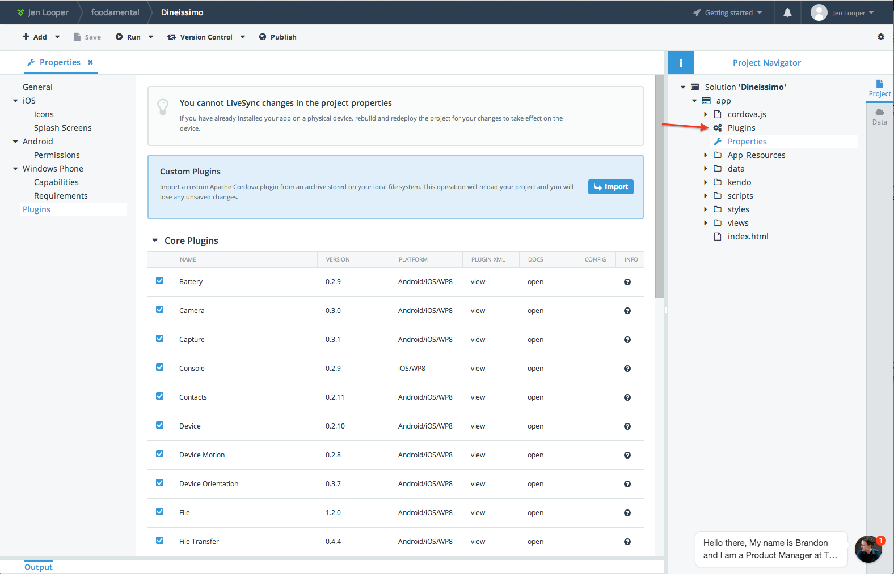
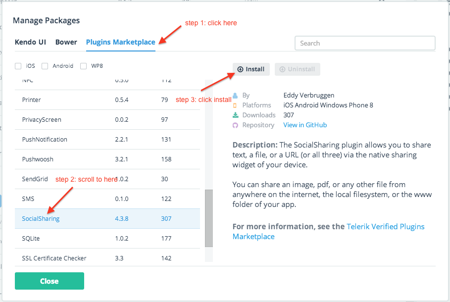
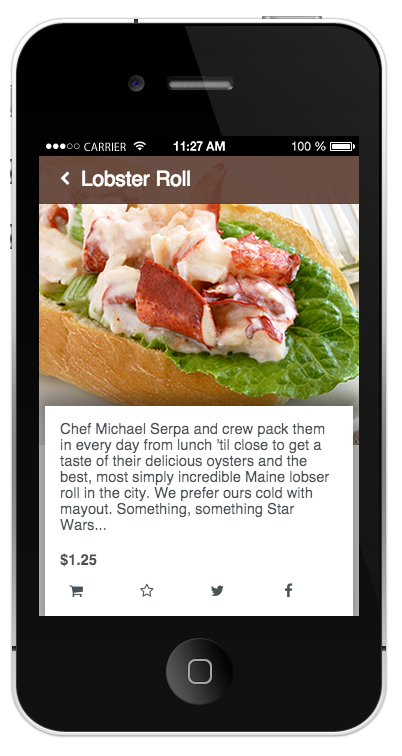
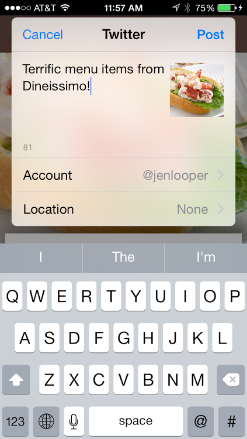

---
##Welcome!
Telerik's Platform solution makes it incredibly easy for developers to build, modify and deploy hybrid mobile apps. We want you to experience the difference yourself. Try out our platform by deploying this sample app, "Dineissimo" to your device. Then, find out how easy it is to alter its look and add cool features by following our helpful tutorials. Each tutorial walks you through different capabilities and has beginner, intermediate and “Ninja” level instructions. Here are the links:

* [Re-skin your app](tutorial-1-dineissimo.md)
* [Add a social plugin](tutorial-2-dineissimo.md)
* [Create a great checkout experience](tutorial-3-dineissimo.md)
* [Add backend cloud services and email notifications](tutorial-4-dineissimo.md)

---

#Getting Friendly: Adding the Social Plugin to the Dineissimo app

While developing your app all by yourself is fun, the real power of a mobile app development platform is brought home when you start leveraging the plugins that the Telerik Platform offers. Telerik has a really nice selection of curated plugins that you can easily install into your app. They are all listed in the [plugins marketplace](http://plugins.telerik.com/); new plugins are frequently added to the marketplace. 

In this tutorial you’re going to install and integrate the Social Share plugin. This plugin allows you to share text, files, or URLs from the Dineissimo interface to your friends. Users of the app should be able to post this content on Twitter, Facebook, WhatsApp, or a SMS provider. 

## Beginner: Getting Started:

### Step 1: Installing the plugin in-browser

For the first part of this tutorial, you will work on the AppBuilder in-browser client (available at [http://platform.telerik.com](http://platform.telerik.com), and later you will install our app on device to test the plugin.

First, install the Social Share plugin into the project in-browser. Right-click on the properties link in the Project Navigator and select 'open'.




Click on 'Plugins' on the left and scroll down to ‘Other Plugins’ and click ‘Install’. A modal window shows the Packages in the Plugins Marketplace and you can search for ‘SocialSharing’. Highlight that plugin and click ‘install’. AppBuilder installs the plugin into your Plugins folder. 



With this plugin installed, you’re now ready to use it within your Dineissimo app. 

## Step 2: Add the Social Sharing interface

Next, you are going to allow users of the app to share a picture of their menu choice via Facebook and Twitter by adding two buttons to the interface.

In the views/menu-details.html file, add the html markup for the buttons within the details-buttons ul markup:


```
<li><span class="fa fa-twitter" data-bind="click: shareTweet"> </span></li>
<li><span class="fa fa-facebook" data-bind="click: shareFacebook"> </span></li> 
```
and in menu-details.css, change the .details-buttons li width to 20% to make room for the buttons:

```
.details-buttons li{
     width: 20%;
...
}
```

Finally, add some functions to call the plugin when tapping the Twitter or Facebook icon that you just added to the detail page. Add the following lines to scripts/viewmodels/menu-details.js under the ‘show’ function:

```
shareTweet: function(e) {
           window.plugins.socialsharing.shareViaTwitter(
“Terrific menu items from Dineissimo!”,
“www/”+e.data.item.imgSrc,
null,
this.onSuccess, 
this.onError
      	);
},
shareFacebook: function(e) {
            window.plugins.socialsharing.shareViaFacebook(
“Terrific menu items from Dineissimo!”,
“www/”+e.data.item.imgSrc,
null,
this.onSuccess, 
this.onError
           );
},
```
>Note: the paths for images within an app need to be prefaced with ‘www/‘ to set the path properly, otherwise when the app is built the images’ path is not referenced.)

### Step 3: Take a look

Click Run on the device of your choice to see how the small buttons look. You can click on a menu item and on the detail page you’ll see the Twitter and Facebook graphic. Clicking on those graphics, unfortunately, doesn’t trigger the Social Share plugin - to really see the plugin in action, we have to build on device. Let’s look at why this doesn’t work, and what you need to do to see this plugin in action.



## Ninja: Test the plugin on device 

Let’s deploy this app on device so we can see how the plugin works.

When integrating plugins, we need to be able to deploy our code to device. In general, device testing can be done using the AppBuilder Companion App, available for all platforms. But for custom plugins like the Social Share plugin, we have to go one step further and do an actual device build to make the app run as a mobile app on your device. Unlike the core Cordova plugins, which are available in the AppBuilder Companion App, custom plugins like SocialSharing must run in a built app to access the native device APIs they need. 

On each platform, preparing for a device build is a somewhat involved procedure—especially for iOS; you will need to install a certificate, provision your device, and build locally—after which AppBuilder will be able to deploy your app to your connected device. 

>Note, the app identifier that you use for your provisioning profile needs to match the identifier that is included in the codebase, so if you need to make a change to match those two, double click ‘properties’ in the Project Navigator and edit the Application Identifier field. It should look like ‘com.company.appname'

Please refer to the following documentation that walks you through the process on each OS. You'll need to complete this setup for your device's OS before continuing.

For iOS: [http://docs.telerik.com/platform/appbuilder/publishing-your-app/distribute-production/publish-adhoc](http://docs.telerik.com/platform/appbuilder/publishing-your-app/distribute-production/publish-adhoc)
For Android: [http://docs.telerik.com/platform/appbuilder/publishing-your-app/distribute-production/distribute-android](http://docs.telerik.com/platform/appbuilder/publishing-your-app/distribute-production/distribute-android)
For Windows Phone: [http://docs.telerik.com/platform/appbuilder/publishing-your-app/distribute-production/wp8-distribute](http://docs.telerik.com/platform/appbuilder/publishing-your-app/distribute-production/wp8-distribute)

Once you have completed your setup, you can click ‘build’ and the interface will walk you through installing the app to your connected device. A QR code is produced by AppBuilder; use a QR reader on your device to download the freshly-built app. 

Find the Twitter and Facebook buttons, and test your integration of the social plugin. You can edit the sendTweet and sendToFacebook functions to change the message sent.




As a further challenge, try integrating more parts of the Social Share plugin. You can make it send an Email or an SMS, or integrate with WhatsApp. Give it a try!


           


