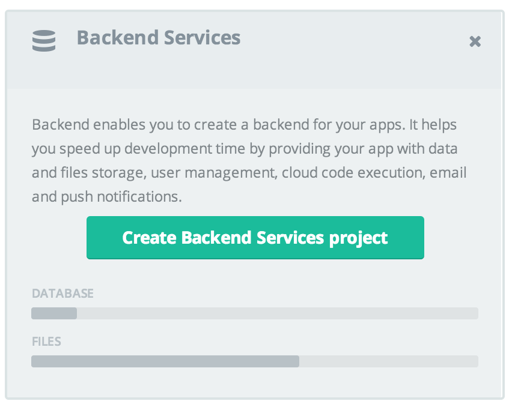
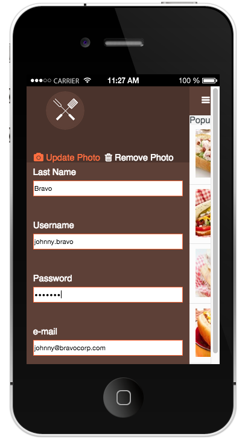
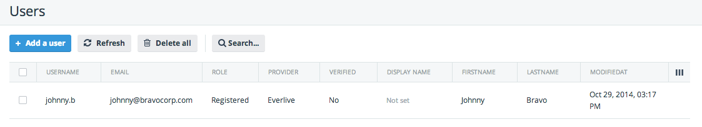
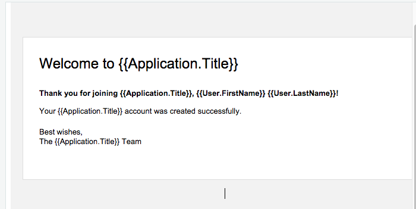

---
##Welcome!
Telerik's Platform solution makes it incredibly easy for developers to build, modify and deploy hybrid mobile apps. We want you to experience the difference yourself. Try out our platform by deploying this sample app, "Dineissimo" to your device. Then, find out how easy it is to alter its look and add cool features by following our helpful tutorials. Each tutorial walks you through different capabilities and has beginner, intermediate and “Ninja” level instructions. Here are the links:

* [Re-skin your app](tutorial-1-dineissimo.md)
* [Add a social plugin](tutorial-2-dineissimo.md)
* [Create a great checkout experience](tutorial-3-dineissimo.md)
* [Add backend cloud services and email notifications](tutorial-4-dineissimo.md)

---

# Add Backend Cloud Services and e-mail notifications to the Dineissimo app

## Getting Started

The Telerik AppBuilder Platform includes a lot of great functionality to help app developers interact with their app users, including backend services, push notifications, cloud code, and email templates that make communication easy. In this tutorial, we'll build out the 'Edit my Profile' screen to allow users to register in the app's backend services and send an email welcoming the user to the Dineissimo app.

### Step 1: Enable the backend

First, in the in-browser Platform, enable backend services for your Dineissimo app by clicking the "Create Backend Services" button:



Backend services are like a database for your app; you can create 'types' which correlate to database tables and configure datatypes and permissions as needed. For our purposes, we are going to use the ready-built Users type, with a few tweaks to make it work with our app's form.

### Step 2: Get your API Key and enable Everlive

1. Click the 'key' icon in the backend services panel and make a note of the API Key which allows your app to feed data to this backend. You're going to need this in a minute. 
2. Next, enable Everlive, another name for the Backend Service, in the index.html file by adding this line above the scripts/app.js included file: 

```
<script src="https://bs-static.cdn.telerik.com/1.2.5/everlive.all.min.js"></script>
```

3. Add the following code to scripts/app.js in the device ready function and under win.app.storeStock.read();

```
var apiKey = "your-api-key";
      win.app.el = new Everlive({
          apiKey: apiKey,
          url: '//api.everlive.com/v1/',
          scheme: 'https'
       });
```
Make sure to change the string 'your-api-key' to the API key that you noted above. Now your app is configured to read and write data from and to the backend.		  
		
### Step 3: Convert the 'Edit my Profile' form to save user details to the backend

In this step, we're going to add some fields to the User type so that we can save several user details from the app to the backend. In the Backend Services panel, click on 'Users' in the left navigation to open that type. In the top right panel, click on the 'branch' icon labelled Structure. A panel opens with all the Users fields delineated. We're going to click 'add' to add two more fields: FirstName and LastName. Once this is done, click 'Save':


Now, let's add some css and edit the form fields. In styles/main.css, add the following css snippet to make the form scroll and place the submit buttons at its bottom: 

```
#bottom-panel {
    bottom: 0;
    height: 66px;
    width: 100%;
    background-color: #ff6e40;
    margin: 0;
    padding-top: 20px;
    margin-top:20px;
}
```

Next, redo the 'Edit my Profile' form in index.html, replacing the "edit-body" div with the following markup:

```
<div id="edit-body">
    <label for="firstName">First Name</label>
    <input type="text" id="firstName" data-bind="value: profile.firstName"/>
    <label for="lastName">Last Name</label>
    <input type="text" id="lastName"  data-bind="value: profile.lastName"/>
    <label for="username">Username</label>
    <input type="text" id="username" data-bind="value: profile.username"/>
    <label for="password">Password</label>
    <input type="password" id="password" data-bind="value: profile.password"/>
    <label for="email">e-mail</label>
    <input type="text" id="email" data-bind="value: profile.email" />
    <div id="bottom-panel">
        <ul id="bottom-buttons">
            <li>
                <a id="update-profile" data-bind="click: updateProfile" href="#">Update</a>
            </li>
            <li class="cancel-li">
                <a id="cancel-profile" data-bind="click: hideEditProfile" href="#">Cancel</a>
            </li>
        </ul>
    </div>
</div>
```
			
Your form should look like this:


			
Finally, add a snippet to the updateProfile function in scripts/viewmodels/edit-profile.js right under  e.preventDefault():

```
if (this.profile.firstName === "" || this.profile.lastName === "" || this.profile.username === "" || this.profile.email === "" || this.profile.password === "") {
    win.app.alert("Please complete all fields.");                
}
    win.app.el.Users.register(this.profile.username, this.profile.password, { Email: this.profile.email, FirstName: this.profile.firstName, LastName: this.profile.lastName },
        function() {
            win.app.alert("Your account was successfully created.");               
        },
        function() {
            win.app.alert("Unfortunately we were unable to create your account.");
        });
```
			
In this function, we watch for the updateProfile click and then check to see that all the form fields are filled in. If they are, we we send the user's information to the backend where it is saved in the Users type. You can see the new user's information by refreshing the type's table:



### Step 4: Edit the Welcome Email Template

Now, some real magic happens in the background. Each app in Appbuilder comes configured with four standard emails by default: Welcome, Verify Account, Reset Password, and Password Reset templates. If a new user is created and the user has an email address, the system sends out a welcome email. It's quite nice! However, the template expects the user to have a 'Display Name' which we do not have in the Dineissimo app, so we need to edit the Email template to avoid any gaps in the email that is sent. Click 'Email' in the left navigation and click on 'Welcome Email':



Click 'edit' in the Email panel and change {{User:DisplayName}} to {{User:FirstName}} {{User:LastName}}. Do this in the html as well as the text email boxes for consistency. Save this change and test your work by adding your email address to the app's form that we just built in the simulator and clicking 'update'. You should receive a lovely personalized email!

##Ninja mode

The email templates included in AppBuilder are nice looking, but you can use your ninja skills and css to personalize them even more. Click on 'html' in the panel where the email template is displayed and try to change the css to make it resemble the color scheme of the Dineissimo app. Now it will look really personalized and awesome!
 
 
